# Creating and using a custom Docker agent image for TaaS Jenkins-on-Kubernetes

Building a custom Jenkins agent docker image for a Jenkins-on-Kubernetes server for wml repository service

## Contents

<!-- START doctoc generated TOC please keep comment here to allow auto update -->
<!-- DON'T EDIT THIS SECTION, INSTEAD RE-RUN doctoc TO UPDATE -->


- [Overview](#overview)
- [Prerequisites](#prerequisites)
- [Step 1. Build the agent image](#step-1-build-the-agent-image)
- [Step 2. Set up credentials](#step-2-set-up-credentials)
- [Step 3. Configure the Kubernetes plugin](#step-3-configure-the-kubernetes-plugin)
- [Step 4. Create and run a test job](#step-4-create-and-run-a-test-job)
- [Step 5. Customize the Dockerfile](#step-5-customize-the-dockerfile)
- [Troubleshooting](#troubleshooting)
- [Sample namespace-credential-injection script](#sample-namespace-credential-injection-script)

<!-- END doctoc generated TOC please keep comment here to allow auto update -->

## Overview

A custom Jenkins agent image for the wml repository build on TaaS Jenkins-on-Kubernetes servers. This image is based on this

This doc will show you how to add your custom image to Jenkins through the system configuration. It is also possible to dynamically define your agent pod in a Jenkinsfile located in a GitHub repo. For more information, see the documentation and examples in the [kubernetes-plugin repo](https://github.com/jenkinsci/kubernetes-plugin) in public GitHub, as well as the [Kubernetes plugin Pipeline page](https://jenkins.io/doc/pipeline/steps/kubernetes/).

The demo image here is based on  this [demo](https://github.ibm.com/TAAS/demo-kubernetes-pod-image) and [official Jenkins JNLP image](https://hub.docker.com/r/jenkins/jnlp-slave/). 

## Prerequisites

Before you can do anything, you will need the following:

- [Docker installed](https://docs.docker.com/engine/installation/) on your local machine.
- A docker registry -> `hyc-wml-repository-team-docker-local.artifactory.swg-devops.com`


## Step 1. Build the agent image

1. Set environment.

    ```shell
    export REPO_URL=hyc-wml-repository-team-docker-local.artifactory.swg-devops.com
    export IMAGE_NAME=wml-repo-agent
    export MLREPO_PATH=<abs path to the ml-repository folder>
    export MVM_SETTINGS_XML_PATH=<abs path to the maven settings.xml>
    ```

1. Build the image.

    ```shell
    docker build -t ${IMAGE_NAME}:test .
    ```

1. Test the image.

    ```shell
    docker run -it --rm -v ${MLREPO_PATH}:/ml-repository -v ${MVM_SETTINGS_XML_PATH}:/settings.xml ${IMAGE_NAME}:test bash
    cd /ml-repository
    mvn clean install -DskipTests=true -U --settings /settings.xml 
    ```

1. Tag and push the image to the docker registry.

    ```shell
    docker tag ${IMAGE_NAME}:test ${REPO_URL}/${IMAGE_NAME}:latest
    docker login ${REPO_URL}
    docker push ${REPO_URL}/${IMAGE_NAME}:latest
    ```
    

## Step 2. Set up credentials

In Kubernetes, a cluster authenticates with a container registry using a Kubernetes `docker-registry` type secret. To help you create secrets for your credentials to your docker registries in TaaS Artifactory or some other private registry location, and to ensure these secrets can be easily updated and recreated as needed<sup>&dagger;</sup>, follow this procedure to maintain Kubernetes secrets in your Jenkins' namespace.

<sup>&dagger;</sup>Some TaaS Jenkins-on-Kubernetes update processes, such as Jenkins version upgrades, delete your namespace, and thus, any secrets that were created there.

1. Add your Artifactory (docker registry) credentials to a Jenkins credential

    Add a Jenkins credential of Kind "Username with password":

    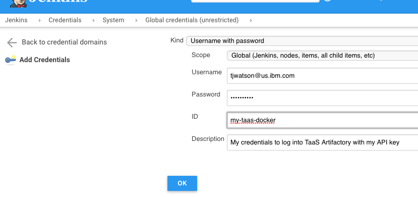

     - TaaS highly recommends using your Artifactory API key rather than your password.
     - Give the credential a descriptive ID instead of relying on the randomly generated default UUID. You'll use this ID later. 

1. Modify the configuration of the `namespace-credential-injection` job in your Jenkins' `jenkins-configuration` folder and add your Jenkins credential to the `credentials_list` array. For example:

    ```groovy
    def credentials_list = [
        'docker-registry': [
            [
                'name': 'another-docker-secret',
                'docker-server': 'my-other-repo.artifactory.swg-devops.com',
                'docker-email': 'tjwatsonl@us.ibm.com',
                'credential-id': 'my-taas-docker'
            ]
        ]
    ]
    ```
    
    Where:
    
    - `name`: the name that will be given to the secret
    - `docker-server`: server location for Docker registry
    - `docker-email`: email for Docker registry
    - `credential-id`: the ID of the Jenkins credential file which will be used to retrieve this secret's docker-username and docker-password
    
1. Build the job. Open the build's console log and you can verify that the secret, `another-docker-secret` in our example, was created:

    ```shell
    [namespace-credential-injection] Running shell script
    + kubectl get secrets
    NAME                      TYPE                                  DATA      AGE
    another-docker-secret     kubernetes.io/dockerconfigjson        1         1s
    default-token-t8qq2       kubernetes.io/service-account-token   3         9d
    swg-devops-com-tls        kubernetes.io/tls                     2         7d
    taas-artifactory-apikey   kubernetes.io/dockerconfigjson        1         7d
    ```

**Notes:**

- TaaS provides the namespace-credential-injection job on all new Jenkins-on-Kubernetes instances. If your Jenkins server does not have this job, see [Sample namespace-credential-injection script](#sample-namespace-credential-injection-script) below.
    
- Rebuild the job whenever you change your Artifactory credentials to update the Kubernetes secret.

- The namespace-credential-injection job is run whenever Jenkins is started, thereby re-injecting your secret whenever the underlying namespace is deleted. 


## Step 3. Configure the Kubernetes plugin

> This documentation is based on the 1.12.6 version of the [Kubernetes plugin](https://wiki.jenkins-ci.org/display/JENKINS/Kubernetes+Plugin) and is subject to change.

The Kubernetes plugin exposes its configuration in the Configure Clouds page in Jenkins (https://my-jenkins.swg-devops.com/configureClouds). (Prior to Jenkins version 2.222.1 this was exposed within the top-level Jenkins configuration page at the bottom of https://my-jenkins.swg-devops.com/configure.) Your TaaS-provisioned Jenkins-on-Kubernetes server should already have an operational "Kubernetes" configuration in the "Cloud" section, as shown below.

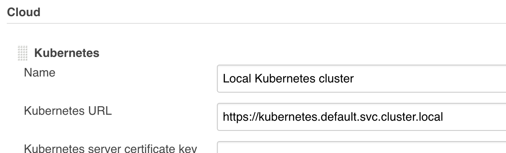

<details><summary>*I don't see the "Kubernetes" section in my Jenkins' configuration (click to expand)*</summary>

1. Find the "Cloud" section of the configuration page, and click on the "ADD A NEW CLOUD" button at the bottom of that section. (The button is usually at the very bottom of the configuration page.)

1. In the resulting drop-down menu, click "Kubernetes".

    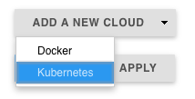

1. Edit the following fields:

    - Name: `Local Kubernetes cluster`
    - Kubernetes URL: `https://kubernetes.default.svc.cluster.local`
    - Disable https certificate check: Select this checkbox
    - Kubernetes Namespace: `<MY-JENKINS>-ns`, where <MY-JENKINS> is the division-teamshortname portion of your Jenkins hostname, or everything except "-jenkins.swg-devops.com". For example, the namespace for "taas-demo-kube-jenkins.swg-devops.com" is "taas-demo-kube-ns".
    - Credentials: `- none -`
    - Jenkins URL: `http://jenkins-http.<MY-JENKINS>-ns.svc.cluster.local:8080`, where <MY-JENKINS> is the division/teamname portion of your Jenkins hostname.
    - Jenkins tunnel: `jenkins-jnlp.<MY-JENKINS>-ns.svc.cluster.local:<JNLP-PORT>`, where <MY-JENKINS> is the division/teamname portion of your Jenkins hostname, and <JNLP-PORT> is the fixed TCP port for JNLP agents that can be found on your Jenkins' Global Security configuration page.
    - Connection Timeout: `0`
    - Read Timeout: `0`
    - Container Cap: `10`
    - Pod Retention: `Never`
    - Max connections to Kubernetes API: `32`
    - Container Cleanup Timeout (under "Advanced"): `5`

Resume following the instructions below.

</details>
    
1. Click on the "ADD A POD TEMPLATE" button to open a new "Kubernetes Pod Template" configuration section. 

    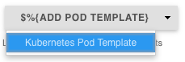

    Edit the following fields:

    - Name: `custom-jnlp-agent-pod`. This is used in the name of the executors that use this image. You can specify a different name.
    - Namespace: `<MY-JENKINS>-ns`, where <MY-JENKINS> is the division-teamshortname portion of your Jenkins hostname, or everything except "-jenkins.swg-devops.com". For example, the namespace for "taas-demo-kube-jenkins.swg-devops.com" is "taas-demo-kube-ns".
    - Labels: `custom-image`. You'll specify this label in the jobs your want to use this image. You can specify a different name.
    - Usage: select "Only build jobs with label expressions matching this node"
    
1. Click "ADD CONTAINER" and select "Container Template". 

    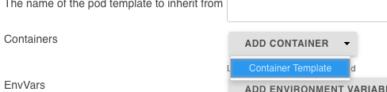

    Fill in the following fields in the Container Template section:

    - Name: `jnlp` (This should always be set to the standard value of "`jnlp`" unless you have explicitly defined another mechanism for the container to connect back to Jenkins)
    - Docker image: enter the location (repo URL / image name) of your custom image. For example, `taas-docker-public.artifactory.swg-devops.com/demo-kubernetes-pod-image:latest`
    - Working directory: `/home/jenkins`
    - Command to run: leave blank
    - Arguments to pass to the command: leave blank
    - Allocate pseudo-TTY: select the checkbox
    - EnvVars: Click the "ADD ENVIRONMENT VARIABLE" and add an "Environment Variable":
        
        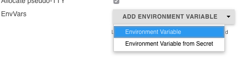
        
        - Key: `DOCKER_HOST`
        - Value: `tcp://docker-in-docker.<MY-JENKINS>-ns.svc.cluster.local:2375`
    - Max number of instances: `10`
    - Timeout in seconds for Jenkins connection: `100`
    - Click the "ADVANCED..." button beneath the "Raw yaml for the Pod" field:
    
        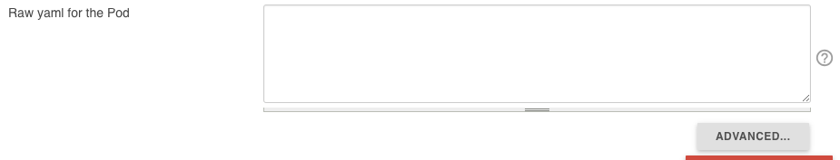
    
    - Click the "ADD IMAGE PULL SECRET" button that is next to the "ImagePullSecrets" field, and select the "Image Pull Secret" option:
    
        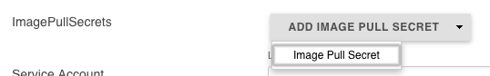
        
    - In the "Name" field, enter the name of the Kubernetes secret that should be used when pulling the image. In the examples in [Step 2. Set up credentials](#step-2-set-up-credentials), this is "another-docker-secret":
    
        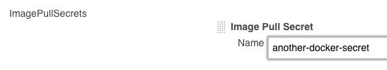

1. Click `SAVE` at the bottom of the configuration page.
    


## Step 4. Create and run a test job

1. On the Jenkins landing page click `New Item`
	- Item name: `Test Job`
	- Select `Freestyle project`
	- Click `OK` (You should be redirected to the `Test Job` config page)
2. In the `Test Job` config page:
	- Restrict where this project can be run: _should be checked_
	- Label Expression: `custom-image` (the label you specified in the Kubernetes Pod Template configuration above)
	- Scroll down to the `Add build step` drop down and select `Execute shell`
	- In the `Execute Shell` command box, enter the following:
		+ `echo "Hello World!`
5. Click `SAVE` (_You should be redirected to the `Test Job` landing page_).
6. On the `Test Job` landing page, click `Build Now`.

Give the job a minute or two to pull down the new image and spin up a container.

**Congratulations!  You've just built a Jenkins job on your own docker image!**


## Step 5. Customize the Dockerfile

Now that you've got Jenkins configured and building jobs on your docker image from your registry, you can customize the Dockerfile with additional packages and configuration changes to run the jobs you need.

If you want a jumpstart, you can also build off of our main [Jenkins-on-Kubernetes agent image](https://github.ibm.com/TAAS/Jenkins-on-Kubernetes/tree/master/docker-image-jenkins-agent-jnlp), which comes standard with a lot of helpful packages installed.

If you're not familiar with writing Dockerfiles, here are some helpful links:
- [Dockerfile Reference](https://docs.docker.com/engine/reference/builder/)
- [Dockerfile Best Practices](https://docs.docker.com/engine/userguide/eng-image/dockerfile_best-practices/)


## Troubleshooting

1. From the "Manage Jenkins" page in your Jenkins, click "Manage Nodes"
    
1. Click "New Node"
    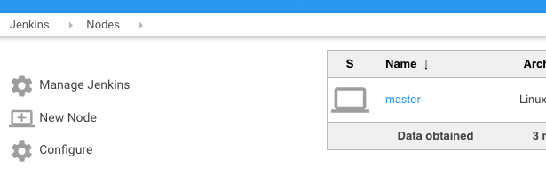
1. Give it a name, click the "Permanent Agent" option, then click OK to create the new node. 
1. Fill in:
    - `Name`: Give this node a name, for example `Debug my agent image`
    - `Remote root directory`: Enter `/home/jenkins`
    - `Labels`: Give this node a unique label, for example `debug-image`
    - `Usage`: Select "Only build jobs with label expressions matching this node`. Together with the label, this ensures that this node won't be used by any job, other than a test job, while you debug the image.
    - `Launch method`: Select "Launch agent via Java Web Start"

    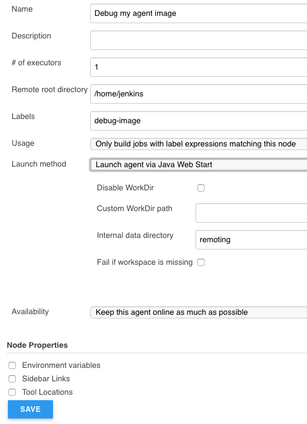
1. Click `SAVE`. Jenkins opens the "Nodes" page where your new node should be listed.
    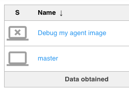
1. Click on the new node's name to open the Agent page for the node.
    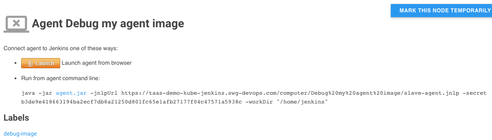
1. Copy the agent command (the long command that starts with `java -jar`).
1. Open the "Log" from the Agent page's left navigation:
    
1. Open a terminal window on your workstation and export the REPO_URL and IMAGE_NAME variables:
    ```shell
    $ export REPO_URL=<REGISTRY-URL>
    $ export IMAGE_NAME=<AGENT-IMAGE-NAME>
    ```
1. Log in to Docker and open a bash session in your image:
    ```shell
    $ docker login
    Authenticating with existing credentials...
    Login Succeeded
    $ docker run -it --rm $REPO_URL/$IMAGE_NAME:tag bash
    jenkins@996d2aaf15fc:~$
    ```
1. Change directory to `/usr/share/jenkins`
1. Paste in the `java -jar...` command from the Agent page, change `agent.jar` to `slave.jar`, and press enter:

    ```shell
    $ java -jar slave.jar -jnlpUrl ...
    Oct 04, 2018 6:48:33 PM org.jenkinsci.remoting.engine.WorkDirManager initializeWorkDir
    INFO: Using /home/jenkins/remoting as a remoting work directory.
    .
    .
    INFO: Connected
    ```
    
    When your agent and Jenkins have successfully connected, you will see `INFO: Connected` in your terminal session.
    
    On the Agent Log page, you should also see that the agent and Jenkins have connected:
    
    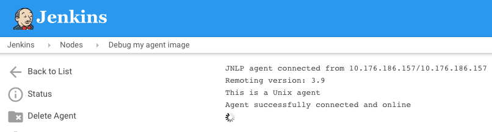

1. In Jenkins, find or create a job you want to use to test or debug your custom image. It can be something as simple as running `printenv` in a shell. Specify the label name you gave your test node (`debug-image` in our example), and build the job.

    Watch the job console log, Agent log page, and your terminal session for any errors.

You can also run a command on the agent from the Node's Script Console page. For example:

```shell
println "whoami".execute().text
println "pwd".execute().text
println "ls -ll".execute().text
```


## Sample namespace-credential-injection script

```groovy
// namespace-credential-injection pipeline

node {

    // sample docker registry secrets. Each object in 'docker-registry' array
    // contains four items:
    // - 'name': the name that will be given to the secret
    // - 'docker-server': server location for Docker registry
    // - 'docker-email': email for Docker registry
    // - 'credential-id': the ID of the Jenkins credential file which will be
    //   used to retrieve this secret's docker-username and docker-password
    //
    // def credentials_list = [
    //     'docker-registry': [
    //         [
    //             'name': 'my-docker-secret',
    //             'docker-server': 'my-repo.artifactory.swg-devops.com',
    //             'docker-email': 'myemail@ibm.com',
    //             'credential-id': 'credential-example-1'
    //         ],
    //         [
    //             'name': 'another-docker-secret',
    //             'docker-server': 'my-other-repo.artifactory.swg-devops.com',
    //             'docker-email': 'myemail@ibm.com',
    //             'credential-id': 'credential-example-2'
    //         ]
    //     ]
    // ]
    
    def credentials_list = [
        'docker-registry': [
        ]
    ]
    
    stage ('List current secrets') {
        sh '''
            kubectl get secrets
        '''
    }
    
    stage ('Adding the docker_registry secrets') {
        credentials_list['docker-registry'].each { credential ->
            withCredentials([usernamePassword(credentialsId: credential['credential-id'], usernameVariable: 'CREDENTIAL_USERNAME', passwordVariable: 'CREDENTIAL_PASSWORD')]) {
                env.SECRET_NAME = credential['name']
                env.DOCKER_SERVER = credential['docker-server']
                env.DOCKER_EMAIL = credential['docker-email']
                // See: 
                //     kubectl create secret docker-registry --help
                // for more information
                sh '''
                    # Disable exit on non 0 so that the job does not exit if we try to delete a secret that does not exist
                    set +e
                    kubectl delete secret ${SECRET_NAME}
                    # Re-enable exit on non 0
                    set -e
                    kubectl create secret docker-registry \
                    ${SECRET_NAME} \
                    --docker-server=${DOCKER_SERVER} \
                    --docker-username=${CREDENTIAL_USERNAME} \
                    --docker-password=${CREDENTIAL_PASSWORD} \
                    --docker-email=${DOCKER_EMAIL}
                '''
            }
        }
    }
    
    stage ('List final secrets') {
        sh '''
            kubectl get secrets
        '''
    }
    
}
```
